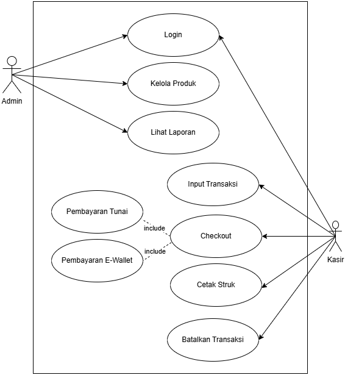

# Laporan Praktikum Minggu 6
Topik: Design Arsitektur Sistem dengan UML dan Prinsip SOLID

## Identitas
- Nama  : Difa Rizkiana Fauziyah
- NIM   : 240320564
- Kelas : 3DSRA

---

## Tujuan
1. Mahasiswa mampu mengidentifikasi kebutuhan sistem ke dalam diagram UML.
2. Mahasiswa mampu menggambar UML Class Diagram dengan relasi antar class yang tepat.
3. Mahasiswa mampu menjelaskan prinsip desain OOP (SOLID).
4. Mahasiswa mampu menerapkan minimal dua prinsip SOLID dalam kode program.

---

## Deskripsi Singkat Sistem
Agri-POS adalah sistem Point of Sale khusus untuk toko pertanian yang mengelola penjualan produk-produk pertanian seperti benih, pupuk, alat, dan obat-obatan. Sistem ini dirancang untuk memudahkan kasir dalam melakukan transaksi penjualan dengan scan produk dan checkout, serta memberikan admin kemampuan mengelola produk (CRUD) dan melihat laporan penjualan.

Sistem mendukung multiple metode pembayaran (tunai dan e-wallet) dengan validasi yang sesuai, mencetak struk otomatis setelah pembayaran berhasil, dan mengelola stok produk secara real-time dengan update otomatis setelah transaksi. Sistem dibangun dengan prinsip-prinsip SOLID menggunakan Factory Pattern untuk pembayaran, sehingga mudah dikembangkan, dipelihara, dan diuji.

---

## Langkah Praktikum
Iterasi disarankan agar progres terpantau dan kualitas meningkat:

- Pemetaan kebutuhan → daftar aktor & use case; gambar Use Case Diagram versi-1.
- Activity Diagram proses “Checkout” (lengkap dengan swimlane Kasir/Sistem/Payment Gateway) + skenario normal dan gagal.
- Sequence Diagram proses pembayaran (variasi: tunai vs e-wallet, alt saldo tidak cukup).
- Class Diagram (atribut/tipe, method, visibility, multiplicity) + mapping prinsip SOLID; revisi konsistensi lintas diagram.

Setiap iterasi lakukan commit incremental dengan pesan: week6-uml-solid: iterasi-N <deskripsi>.

---

## Penjelasan Setiap Diagram
1. Usecase Diagram

Fungsi: Menggambarkan interaksi antara aktor dengan sistem Agri-POS, menunjukkan fungsionalitas yang dapat diakses oleh setiap aktor.

Aktor:
- Admin: Mengelola produk (CRUD), melihat laporan, dan login ke sistem.
- Kasir: Melakukan input transaksi, checkout, cetak struk, batalkan transaksi, dan login ke sistem.

Keterkaitan: Use Case Diagram menjadi dasar untuk menentukan class-class yang dibutuhkan dalam Class Diagram dan alur proses dalam Activity serta Sequence Diagram. Setiap use case akan diimplementasikan oleh satu atau lebih class pada Class Diagram.

---

2. Activity Diagram

Fungsi: Menggambarkan alur proses checkout dari scan produk hingga cetak struk dalam bentuk flowchart dengan decision points.

Keterkaitan: Activity Diagram mendetailkan use case "Checkout" dan menjadi acuan untuk Sequence Diagram. Setiap activity akan dipetakan ke method-method pada class di Class Diagram.

---

3. Sequence Diagram

Fungsi: Menunjukkan interaksi antar objek dalam proses checkout secara berurutan dengan message passing, menggunakan Factory Pattern untuk implementasi OCP.

Keterkaitan: Sequence Diagram mengimplementasikan Activity Diagram dan menggunakan class dari Class Diagram. Method seperti checkout(), createPayment(), process(), saveTransaction() semua terdefinisi di Class Diagram. Guard conditions [alt] sesuai dengan decision points di Activity Diagram.

---

4. Class Diagram

Fungsi: Menggambarkan struktur statis sistem meliputi class, atribut, method, dan relasi antar class dengan implementasi SOLID principles.

Keterkaitan: Class Diagram adalah representasi statis dari sistem yang digunakan oleh semua diagram lainnya. Semua objek di Sequence Diagram adalah instance dari class-class ini. Method di Sequence Diagram adalah method yang terdefinisi di class ini. Relasi composition/aggregation menentukan lifecycle objek saat runtime.

---

## Penerapan Prinsip SOLID
Desain Sistem Agri-POS mengimplementasikan lima prinsip SOLID secara konsisten untuk menciptakan arsitektur yang mudah dikembangkan.

S - Single Responsibility Principle (SRP) menekankan bahwa setiap kelas harus memiliki satu fokus utama. Misalnya, CheckoutService fokus pada logika checkout, ProductService fokus pada manajemen produk, PaymentFactory fokus pada pembuatan objek payment.

O - Open/Closed Principle (OCP) mengharuskan class terbuka untuk perluasan (extension) namun tertutup unutk modifikasi. Penerapan PaymentFactory dengan PaymentMethod interface memungkinkan penambahan metode baru (Transfer, QRIS) tanpa ubah CheckoutService.

L - Liskov SUbstitution Principle (LSP) menekankan bahwa objek class turunan harus dapat menggantikan objek dari class induknya tanpa merusak kesesuaian program. Dalam Agri-POS, misalnya, CashPayment dan EWalletPayment memiliki contract yang sama.

I - Interface Segresgation Principle (ISP) sistem menciptakan interface yang spesifik. PaymentMethod hanya punya method process(), tidak memaksakan implement method yang tidak digunakan seperti pencetakan struk, dll.

D - Dependency Inversion Principle (DIP) mengharuskan High-level module (CheckoutService) tidak bergantung pada modul tingkat rendah, melainkan keduanya harus bergantung pada abstraction (PaymentFactory interface). Penerapan prinsip ini memudahkan testing menjadi lebih cepat dan reliable.

---

## Tabel Traceability 

| FR | Functional Requirement | Use Case | Activity/Sequence | Class/Interface |
|----|------------------------|----------|-------------------|-----------------|
| FR-01 | Manajemen Produk | UC-02: Kelola Produk | - | Produk, Admin, ProductService |
| FR-02 | Transaksi Penjualan | UC-04: Input Transaksi, UC-05: Checkout | Activity: Checkout, Sequence: checkout() | Transaksi, Keranjang, KeranjangItem, Kasir, CheckoutService |
| FR-03 | Pembayaran Tunai | UC-05: Checkout (include) | Sequence: createPayment("Tunai") | PaymentMethod, CashPayment, PaymentFactory |
| FR-04 | Pembayaran E-Wallet | UC-05: Checkout (include) | Sequence: createPayment("E-Wallet") | PaymentMethod, EWalletPayment, PaymentGateway, PaymentFactory |
| FR-05 | Pencetakan Struk | UC-06: Cetak Struk | Sequence: receiptData | Struk |
| FR-06 | Laporan Penjualan | UC-03: Lihat Laporan | - | Admin, ReportService |
| FR-07 | Login & Hak Akses | UC-01: Login | - | Kasir, Admin, AuthService |
| FR-08 | Validasi Stok | UC-04: Input Transaksi | Activity: Stok Tersedia? | ProductService, Produk |

---

## Kesimpulan dan Refleksi
Secara keseluruhan, desain sistem Agri-POS berhasil mengintegrasikan konsep UML dan prinsip SOLID dengan baik. Melalui empat diagram UML yang saling terhubung (Use Case, Activity, Sequence, dan Class), sistem dapat divisualisasikan secara komprehensif dari berbagai perspektif. Penerapan Factory Pattern dan Strategy Pattern dalam sistem pembayaran menunjukkan implementasi konkret dari prinsip Open/Closed dan Liskov Substitution, menghasilkan arsitektur yang extensible dan maintainable.

Pemisahan tanggung jawab yang jelas antar komponen (CheckoutService, ProductService, PaymentFactory) sesuai dengan Single Responsibility Principle memudahkan proses maintenance dan pengembangan di masa mendatang. Penggunaan dependency injection dan abstraction melalui interface tidak hanya meningkatkan testability sistem, tetapi juga memberikan fleksibilitas untuk mengadopsi perubahan kebutuhan bisnis tanpa harus melakukan refactoring besar-besaran. Dengan fondasi SOLID yang kuat, sistem Agri-POS siap untuk dikembangkan dengan fitur-fitur baru seperti QRIS payment, loyalty program, atau multi-warehouse management.

---

## Quiz
1. Jelaskan perbedaan **aggregation** dan **composition** serta berikan contoh penerapannya pada desain Anda.  
   **Jawaban:** Composition adalah relasi yang kuat di mana objek bagian tidak dapat exist tanpa objek induk, sehingga ketika induk dihapus maka bagian juga ikut terhapus. Contohnya pada desain Agri-POS adalah relasi Transaksi dan Keranjang, karena Keranjang hanya ada dalam konteks suatu Transaksi dan tidak memiliki eksistensi independen. Aggregation adalah relasi yang lebih lemah di mana objek bagian dapat exist secara mandiri meskipun objek induk dihapus. Contohnya adalah relasi admin dan Produk`, karena Produk tetap exist di sistem meskipun Admin yang mengelolanya berganti atau dihapus. 

2. Bagaimana prinsip **Open/Closed** dapat memastikan sistem mudah dikembangkan?  
   **Jawaban:** Prinsip Open/Closed memastikan sistem mudah dikembangkan dengan membuat kode terbuka untuk perluasan namun tertutup untuk modifikasi. Dalam Agri-POS, ketika ingin menambahkan metode pembayaran baru seperti QRIS, developer cukup membuat class QRISPayment yang mengimplementasikan interface PaymentMethod dan menambahkan case di PaymentFactory, tanpa perlu mengubah kode existing di CheckoutService atau payment method lainnya. Hal ini meminimalkan risiko bug pada fitur yang sudah berjalan dan mempercepat proses development.  

3. Mengapa **Dependency Inversion Principle (DIP)** meningkatkan **testability**? Berikan contoh penerapannya.  
   **Jawaban:** DIP meningkatkan testability karena high-level module bergantung pada abstraction bukan implementasi konkret, sehingga memudahkan replacement dengan mock objects saat testing. Contoh penerapannya pada Agri-POS adalah CheckoutService yang bergantung pada interface PaymentFactory, bukan pada kelas konkret DefaultPaymentFactory. Ketika melakukan unit testing, developer dapat meng-inject MockPaymentFactory yang selalu mengembalikan payment sukses tanpa perlu koneksi ke payment gateway eksternal atau database real. Hal ini membuat testing lebih cepat, isolated, dan reliable karena behavior dependencies sepenuhnya terkontrol.  
