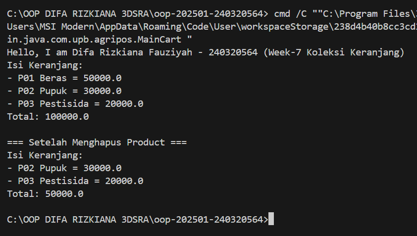

# Laporan Praktikum Minggu 7
Topik: Collections dan Implementasi Keranjang Belanja

## Identitas
- Nama  : Difa Rizkiana Fauziyah
- NIM   : 240320564
- Kelas : 3DSRA

---

## Tujuan
1. Menjelaskan konsep collection dalam Java (List, Map, Set).
2. Menggunakan ArrayList untuk menyimpan dan mengelola objek.
3. Mengimplementasikan Map atau Set sesuai kebutuhan pengelolaan data.
4. Melakukan operasi dasar pada collection: tambah, hapus, dan hitung total.
5. Menganalisis efisiensi penggunaan collection dalam konteks sistem Agri-POS.

---

## Dasar Teori

### 1. Collections Framework

Java Collections Framework menyediakan struktur data untuk mengelola objek secara dinamis dan efisien.

Struktur utama:

- List (implementasi: ArrayList) — Terurut, dapat menyimpan elemen duplikat.
- Map (implementasi: HashMap) — Menyimpan pasangan key–value, akses cepat berdasarkan key.
- Set (implementasi: HashSet) — Tidak menerima duplikat dan tidak mempertahankan urutan.

---

### 2. Studi Kasus: Keranjang Belanja Agri-POS

Keranjang belanja harus dapat:

- Menambahkan produk
- Menghapus produk
- Menampilkan isi keranjang
- Menghitung total nilai transaksi
- Menangani jumlah (quantity) menggunakan Map

Kasus ini mencerminkan penggunaan struktur data dalam aplikasi nyata seperti POS.

---

## Langkah Praktikum
1. Membuat Class Product
2. Implementasi Keranjang dengan ArrayList
3. Main Program
4. Implementasi Alternatif Menggunakan Map (Dengan Quantity)
5. Commit message: week7-collections: [fitur] [deskripsi singkat]

---

## Kode Program
1. MainCart.java

```java
package main.java.com.upb.agripos;

public class MainCart {
    public static void main(String[] args) {
        System.out.println("Hello, I am Difa Rizkiana Fauziyah - 240320564 (Week-7 Koleksi Keranjang)");

        Product p1 = new Product("P01", "Beras", 50000);
        Product p2 = new Product("P02", "Pupuk", 30000);
        Product p3 = new Product("P03", "Pestisida", 20000);

        ShoppingCart cart = new ShoppingCart();
        cart.addProduct(p1);
        cart.addProduct(p2);
        cart.addProduct(p3);
        cart.printCart();

        System.out.println("\n=== Setelah Menghapus Product ===");
        cart.removeProduct(p1);
        cart.printCart();
    }
}
```
2. MainCartMap.java
```java
package main.java.com.upb.agripos;

public class MainCartMap {
    public static void main(String[] args) {
        System.out.println("Hello, I am Difa Rizkiana Fauziyah - 240320564 (Week-7 Koleksi Keranjang)");

        Product p1 = new Product("P01", "Beras", 50000);
        Product p2 = new Product("P02", "Pupuk", 30000);
        Product p3 = new Product("P03", "Pestisida", 20000);

        ShoppingCartMap cartMap = new ShoppingCartMap();
        cartMap.addProduct(p1);
        cartMap.addProduct(p1);
        cartMap.addProduct(p2);
        cartMap.addProduct(p3);
        cartMap.printCart();

        System.out.println("\n=== Setelah Menghapus Product ===");
        cartMap.removeProduct(p1);
        cartMap.printCart();
    }    
}
```

---

## Hasil Eksekusi
1. Output MainCart


2. Output MainCartMap

---

## Analisis
1. Cara Kerja Kode

   Program ini mengimplementasikan sistem keranjang belanja Agri-POS menggunakan dua pendekatan Collections Framework. Class Product merepresentasikan produk dengan atribut code, name, dan price yang bersifat final untuk menjaga immutability data.
   
   Implementasi ShoppingCart menggunakan ArrayList untuk menyimpan produk secara terurut. Setiap penambahan produk akan menambah item baru ke dalam list, bahkan untuk produk yang sama. Method getTotal() melakukan iterasi untuk menghitung total harga, sedangkan printCart() menampilkan seluruh isi keranjang.
   
   Implementasi ShoppingCartMap menggunakan HashMap dengan Product sebagai key dan Integer sebagai quantity. Ketika produk yang sama ditambahkan, quantity-nya akan bertambah menggunakan getOrDefault(). Method removeProduct() mengurangi quantity atau menghapus entry jika quantity mencapai nol. Perhitungan total dilakukan dengan mengalikan harga produk dengan quantity-nya.
   
   Class MainCart mendemonstrasikan penggunaan ArrayList dengan operasi tambah dan hapus produk sederhana. Sedangkan MainCartMap menunjukkan keunggulan HashMap dalam menangani quantity, di mana produk p1 ditambahkan dua kali menghasilkan quantity 2 bukan duplikasi item. Setelah operasi removeProduct(), quantity p1 berkurang menjadi 1 tanpa menghilangkan produk sepenuhnya dari keranjang.

2. Perbedaan dengan Praktikum Sebelumnya

   Praktikum sebelumnya fokus pada konsep uml diagram, sedangkan praktikum ini menekankan penggunaan struktur data collection untuk pengelolaan data dinamis dan manipulasi objek secara efisien.

3. Kendala yang Dihadapi

   Kendala utama adalah memahami perbedaan perilaku ArrayList yang menyimpan referensi objek langsung dengan HashMap yang menggunakan pasangan key-value. Implementasi logic quantity pada HashMap memerlukan pemahaman mendalam tentang method getOrDefault() dan penanganan kondisi penghapusan produk.

---

## Kesimpulan
Program ini berhasil mendemonstrasikan penggunaan Java Collections Framework dalam sistem keranjang belanja Agri-POS. ArrayList cocok untuk kasus sederhana tanpa pengelolaan quantity, sementara HashMap lebih efisien untuk menangani quantity produk dengan menghindari duplikasi dan memberikan akses cepat. Pemilihan struktur data yang tepat sangat bergantung pada kebutuhan aplikasi, di mana ArrayList memberikan kemudahan iterasi berurutan dan HashMap memberikan efisiensi dalam pengelolaan data unik dengan nilai terkait.

---

## Quiz
1. Jelaskan perbedaan mendasar antara List, Map, dan Set.
  
   **Jawaban:** List adalah collection terurut yang memperbolehkan duplikasi elemen dan akses berdasarkan indeks. Map menyimpan data dalam pasangan key-value di mana setiap key harus unik dan memungkinkan pencarian cepat berdasarkan key. Set adalah collection yang tidak memperbolehkan duplikasi elemen dan tidak menjamin urutan penyimpanan data. 

2. Mengapa ArrayList cocok digunakan untuk keranjang belanja sederhana? 

   **Jawaban:** ArrayList cocok untuk keranjang belanja sederhana karena dapat menyimpan objek produk secara berurutan sesuai waktu penambahan dan memudahkan iterasi untuk menampilkan atau menghitung total. Struktur ini efisien untuk operasi penambahan di akhir list dan cocok ketika tidak perlu menangani quantity produk yang sama. 

3. Bagaimana struktur Set mencegah duplikasi data?  

   **Jawaban:**  Set mencegah duplikasi data dengan menggunakan method equals() dan hashCode() untuk membandingkan objek. Ketika ada upaya menambahkan elemen yang sudah ada, Set akan menolak penambahan tersebut sehingga hanya menyimpan elemen unik. Implementasi seperti HashSet menggunakan hashing untuk memastikan keunikan data dengan efisien. 

4. Kapan sebaiknya menggunakan Map dibandingkan List? Jelaskan dengan contoh.
   
   **Jawaban:** Map sebaiknya digunakan ketika data memerlukan asosiasi antara key dan value, serta membutuhkan akses cepat berdasarkan key. Contohnya pada keranjang belanja yang menangani quantity, di mana Product sebagai key dan Integer sebagai quantity menjadi value. Dengan Map, penambahan produk yang sama akan meningkatkan quantity-nya, bukan menambah entry baru seperti pada List. Ini lebih efisien untuk pencarian dan pengelolaan data yang memiliki identitas unik.
